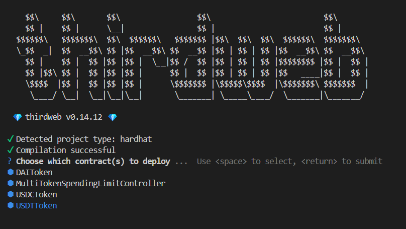
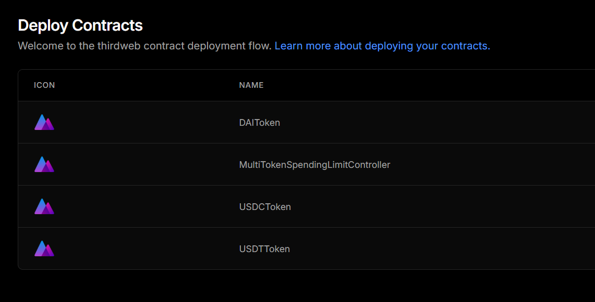

# FlowPay Documentation - Group 12

`Description:` FlowPay is a Web3 solution that simplifies and secures stablecoin transactions for users and businesses. 

`Industry Focused:` Finance

`Devices Supported:` Laptop / Desktop / Smart Phone / Mobile Phone with Internet Connection Support

`Application Type:` dapp (DeFi) - Progressive Web Application (PWA)

`Logo:` 

<p align="center">
    
</p>


# System Setup
`Note:` This section will discuss the steps to setup the FlowPay Project in detail. 

## Pre-Requisite
* MetaMask Wallet (EOA)
* Node.js - v22.14 
* Node Package Manager (npm) or Performant Node Package Manager (pnpm) - v10.6
* Next.js - v15.2.4 [with Tailwind CSS]
* Hardhat - v2.22.19
* TypeScript - v0.8.0
* Solidity - v5.8.3
* Ether.js - v6
* Thirdweb SDK - v5
* ThirdWeb Account
* VS Code (or any relevant IDE)
* Ngrok - v3.22.1 (Optional - for mobile and computer connection testing)

## ThirdWeb

<b>Step 1:</b> Head to Thirdweb `https://thirdweb.com/login` Login with Metamask

<p align="center">
  
</p>

<b>Step 2:</b> Create a New Project

<p align="center">
    
</p>

<b>Step 3: </b> Acquire Client Key and Secret Key in Project Dashboard

<p align="center">
    
</p>

## EtherScan
<b> Step 1:</b> Head to `https://etherscan.io/login`

<b> Step 2:</b> Sign in to Etherscan <u>or</u> Sign up an Account.

<b> Step 3:</b> Head to Dashboard and Add a new API key.
<p align="center">
    
</p>

<b> Step 4:</b> Get your Etherscan API Key for Frontend Setup.

## Smart Contracts / Backend
<b>Step 1:</b> Clone the repo in `https://github.com/flow-pay/flowpay-contracts`
```bash
git clone https://github.com/flow-pay/flowpay-contracts.git
```

<b>Step 2:</b> Install all the relevant dependencies for the project.
```bash
pnpm install
```

<b>Step 3:</b> Deploy the contracts to ThirdWeb.
```bash
npx thirdweb deploy -k <Secretkey of Created Thirdweb Project>
```

<b>Step 4:</b> Select all contracts and press `Enter`

<p align="center">
    
</p>

<b> Step 5:</b> Press the given link after deployed contracts.

<p align="center">
    
</p>

<b> Step 6: </b> Deploy all contracts to created project.

<p align="center">
    
</p>

<b> Step 7: </b> Press in all Contracts & Fill Up Relevant Information and Deploy to Sepolia Chain. 

```
DAI Token - 
Name: Mock DAI
Symbol: DAI
Chain: Sepolia

USDC Token -
Name: Mock USDC
Symbol: USDC
Chain: Sepolia

USDT Token -
Name: Mock USDT
Symbol: USDT
Chain: Sepolia

MultiTokenSpendingLimitController -
Chain: Sepolia
```

<b> Step 8: </b> Acquire your Contract Addresses by pressing <u>Contracts</u> in Side Navigator.

<p align="center">
    
</p>

<b> Testing: </b> Run test cases. (Optional)

``` bash
pnpm run test
```

<b> Deploying Locally: </b> Deploying contracts in Hardhat (Optional)

```bash
npx hardhat node
```
```bash
pnpm run deploy
```

## Front-End / UI

<b>Step 1:</b> Clone the repo in `https://github.com/flow-pay/flowpay-web`

```bash
git clone https://github.com/flow-pay/flowpay-web.git
```

<b> Step 2:</b> Install the relevant dependencies for the project.

```bash
pnpm install
```

<b> Step 3: </b> Create a <u>.env.local</u> file to setup relevant information.

```
NEXT_PUBLIC_THIRDWEB_AUTH_DOMAIN=localhost:3000

NEXT_PUBLIC_THIRDWEB_CLIENT_ID= <Client ID in Created Thirdweb Project>

THIRDWEB_SECRET_KEY= <Secret Key in Created Thirdweb Project>

THIRDWEB_ADMIN_PRIVATE_KEY= <Private Key of Your MetaMask Account>

NEXT_PUBLIC_THIRDWEB_USDT_CONTRACT_ADDRESS= <Contract Address of USDTToken Deployed in ThirdWeb>

NEXT_PUBLIC_THIRDWEB_USDC_CONTRACT_ADDRESS= <Contract Address of USDCToken Deployed in ThirdWeb>

NEXT_PUBLIC_THIRDWEB_DAI_CONTRACT_ADDRESS= <Contract Address of DAIToken Deployed in ThirdWeb>

NEXT_PUBLIC_ETHERSCAN_API_KEY= <Etherscan API Key>

NEXT_PUBLIC_THIRDWEB_SPEND_LIMIT_CONTRACT_ADDRESS= <Contract Address of MultiTokenSpendingLimitController Deployed in Thirdweb>
```

<b> Step 4: </b> Run the Project in Localhost.
```bash
pnpm run dev
```

## Ngrok (Optional)
<b> Step 1: </b> Head to `ngrok.com` and create an account.

<b> Step 2: </b> Install Ngrok `https://dashboard.ngrok.com/get-started/setup/windows`.

<b> Step 3: </b> Run `pnpm run dev` in the Frontend repo and open another terminal and execute `ngrok http 3000`. For more advanced guidance (like authentication setup) do refer the sample in:

`https://github.com/flow-pay/flowpay-web/blob/main/sample-ngrok-config.txt`

<b> Step 4: </b> Acquire the public domain given.

Terminal 1: `pnpm run dev`
<p align="center">
    
</p>

Terminal 2: `ngrok http 3000`
<p align="center">
    
</p>

`Note:` Use other devices to link to the public domain given to perform testing like (QR Code Scanning and etc.)

# System Features
`System Purposes:` Improve Transparency, Security, Streamline Payment Process Flow and Promote Gasless Transactions with ENS Integration.

<b> Key Features : </b>
- Smart Account Creation
  - Allow users to create smart account by authenticating themselves through MetaMask EOA (Signature).

- QR Code Stablecoins Transfer
  - Support QR-based transactions on both mobile devices and computers.
  - Allow users to generate and download QR codes for payments or requesting for payments.

- Batch Transaction
  - Implement batch processing method for gas fee reduction.
  - Signature required for identity validation before transaction approval to enhance system security.

- Paymaster Integration (Sponsor for Gas Fee)
  - Enable sponsoring of gas fees for users' transactions by FlowPay's default paymaster.

- View Sponsor History & Details
  - Enable users to view their sponsored payment history and details.
  - Summary overview regarding their average transaction gas fees in the platform. 

- Daily Spent Limit
  -  To allow users to set their daily usage limits for different tokens.
  -  This feature is to prevent overspending in a day while also act as a security measures.

- Track Daily Spend Amount
  -  Allow users to see their total daily transaction amount by totaling up the value of different tokens. 

- Transaction History Tracking
  - View and track users' transaction history in the activity of spending and receiving thorough the FlowPay app.  

- Credit Risk Assessment
  - Evaluate user creditworthiness based on on-chain activities to enable informed decision-making.

- ENS Support
  - Ease up the transaction with the support of ENS rather than using a long and complex public address.


# Contributors

- TP065158 - Soh Jia Seng 

- TP065176 - Tan Wei Hup

- TP065109 - Jeremy Kok Yong Xuan 

- TP065324 - Kelly Lai Mei Ling 